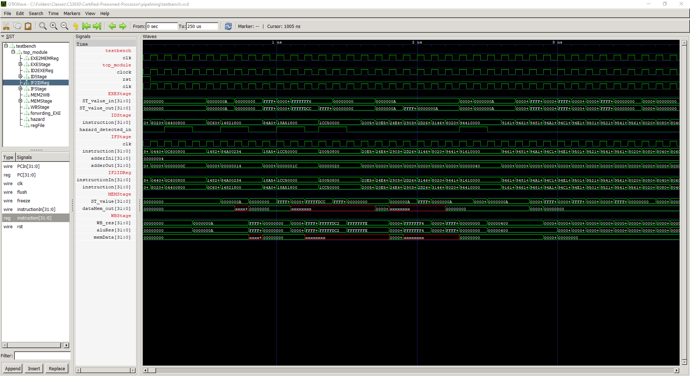

# Certified-Preowned-Processor
Alejandro Mora-Lopez

Cameron J. Larsen

Pierlorenzo Peruzzo

## 1) Single-Cycle Implementation
Single-Cycle Implementation of a MIPS processor in Verilog: https://electrobinary.blogspot.com/2021/02/mips-processor-design-using-verilog-part1.html

The single-cycle MIPS processor was built on the ALU which was used in Project 0. This ALU did not support jump instructions, giving us the learning experience of implementing a jump instruction using what we know on how they are executed. The waveforms below demonstrate the following instructions:
* 00: add $t1, $t2, $t3
* 04: lw $t1, $t2, 16'd4
* 08: beq $t1, $t2, offset
* 0C: add $t1, $t2, $t3
* 10: or $t2, $t3, $t4
* 14: sw $t1, $t2, offset
* 18: j 0x0000000

## 2) 5-Stage Pipelining Implementation
For the 5-Stage Pipelining implementation we had to work with the existing code from the Single-Cycle Implementation. With 5-stage pipelining we had to divide the steps required to execute an instruction into five stages, to then be performed concurrently in different clock cycles. This improved the performance and speed of the processor.
Waves (also available in the .gtkw file) are shown below:

Examining the Verilog code taught us a lot on how the MIPS processor was implemented. 

## Our Findings ##
* There are certain values which are always calculated even if they are not used by the instruction.
  * As demonstrated by our waveforms, a jump address was calculated while an add instruction was executing, which does not require this value.
* Ternary operators can be chained in Verilog for use in assign statements
  * Can be used to assign a branch address, jump address, or PC + 4 as the next address to be executed
* Gained practice on converting MIPS instructions into hex as this is how they are stored into instruction memory
