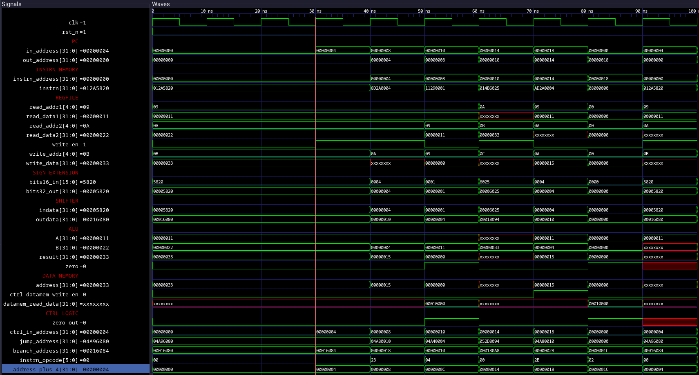

# Certified-Preowned-Processor
Alejandro Mora-Lopez

Cameron J. Larsen

Pierlorenzo Peruzzo

Single-Cycle Implementation of a MIPS processor in Verilog: https://electrobinary.blogspot.com/2021/02/mips-processor-design-using-verilog-part1.html

The single-cycle MIPS processor was built on the ALU which was used in Project 0. This ALU did not support jump instructions, giving us the learning experience of implementing a jump instruction using what we know on how they are executed. The waveforms below show add, jump, branch, OR, as well as sw instructions which were tested using the single-cycle processor.

Examining the Verilog code taught us a lot on how the MIPS processor was implemented. 

## Our Findings ##
* There are certain values which are always calculated even if they are not used by the instruction.
  * As demonstrated by our waveforms, a jump address was calculated while an add instruction was executing, which does not require this value.
* Ternary operators can be chained in Verilog for use in assign statements
  * Can be used to assign a branch address, jump address, or PC + 4 as the next address to be executed
* Gained practice on converting MIPS instructions into hex as this is how they are stored into instruction memory
*
